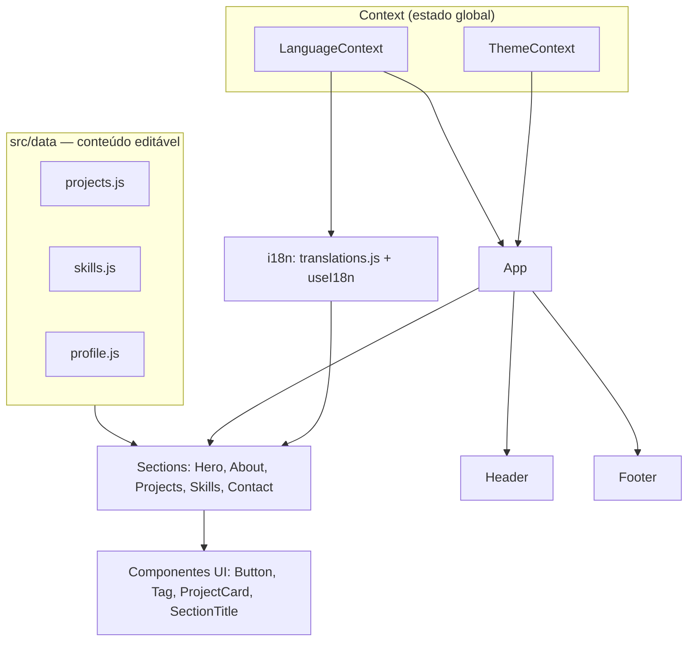

# Portfólio — Artur Nery


Portfólio pessoal para apresentar meus projetos profissionais (freelance) e
acadêmicos. Site estático, responsivo e bilíngue (PT/EN), construído com React +
Vite e CSS Modules, sem dependências de UI pesadas — foco em performance,
acessibilidade e código fácil de manter.

> **Por que existe:** estou em busca da minha primeira oportunidade como
> desenvolvedor. Em vez de usar um template pronto, construí o portfólio do zero
> para demonstrar fundamentos reais de front-end: theming com CSS custom
> properties, internacionalização sem libs, componentes reutilizáveis e HTML
> acessível.

---

## Demo

🔗 **Online:** https://portfolio-puce-psi-62.vercel.app

<!-- Substitua pelos seus prints/GIF (sugestão: um do tema claro e um do escuro) -->
> `[ADICIONAR SCREENSHOT/GIF AQUI — ex.: docs/preview-dark.png e docs/preview-light.png]`

---

## Funcionalidades

- 🌗 **Dark / light mode** com persistência (`localStorage`) e sem flash de tema
  no carregamento (FOUC evitado via script inline antes do React montar).
- 🌐 **Internacionalização PT/EN** com sistema próprio de i18n (objeto de
  traduções + hook `useI18n`), sem bibliotecas.
- 🗂️ **Projetos centralizados em um único arquivo de dados** (`src/data/projects.js`),
  separados do layout — adicionar um projeto não exige tocar em componentes.
- ⭐ **Seção de projetos em dois níveis:** faixa de destaque para trabalhos
  freelance (cards maiores) + grid para projetos acadêmicos.
- ♿ **Acessibilidade:** HTML semântico, `aria-label` nos controles, navegação
  por teclado, *skip link*, foco visível e contraste AA.
- 📱 **Responsivo mobile-first**, testado em 360px, 768px e 1280px.
- ⚡ **Performance:** sem libs de UI, *lazy loading* de imagens, CSS enxuto
  (~3,8 KB gzip) e bundle JS ~53 KB gzip.

---

## Stack e arquitetura

| Camada        | Tecnologia                              |
| ------------- | --------------------------------------- |
| UI            | React 18                                |
| Build/dev     | Vite 5                                  |
| Estilo        | CSS Modules + CSS Custom Properties     |
| i18n          | Solução própria (objeto + hook)         |
| Estado global | React Context (tema e idioma)           |
| Deploy        | Vercel (estático)                       |

A aplicação é um SPA estático. Os dados (projetos, skills, perfil) vivem em
arquivos JS puros, e a UI apenas os consome — separação clara entre **conteúdo**
e **apresentação**.



---

## Decisões técnicas e trade-offs

Esta seção é o "porquê" por trás do código.

- **CSS Modules + custom properties, e não Tailwind.**
  O theming dark/light fica centralizado: defino tokens (`--bg`, `--text`,
  `--accent`) uma vez e troco tudo com `[data-theme="dark"]`. Com utility
  classes eu espalharia `dark:` por todo componente. Além disso, escrever CSS
  real (Grid, Flexbox, `clamp()`, transições) demonstra fundamentos — e mantém o
  bundle menor, o que ajuda no Lighthouse. **Trade-off:** escrever CSS à mão é
  mais verboso que classes utilitárias; aceitei isso em troca de controle e peso.

- **i18n próprio em vez de `react-i18next`.**
  O site tem poucas dezenas de strings. Um objeto `{ pt, en }` + um hook `t()`
  resolvem com ~20 linhas, zero dependências e bundle menor. **Trade-off:** não
  tenho pluralização/interpolação avançada — que este projeto não precisa. Se a
  complexidade crescesse, a troca por uma lib seria direta.

- **Dados separados da UI (`src/data/`).**
  Adicionar/editar projeto é mexer em um array, não em JSX. Cada projeto já tem
  o campo `categoria`, então **adicionar um filtro no futuro é trivial** — a UI
  não precisa mudar.

- **Evitar o flash de tema (FOUC).**
  Um pequeno script inline no `index.html` aplica o tema salvo **antes** do React
  montar. Sem isso, o usuário veria um piscar do tema padrão. **Trade-off:** um
  script inline pequeno, em troca de uma primeira renderização correta.

- **Ícones como SVG inline, sem biblioteca.**
  Importar uma lib de ícones traria centenas de KB para usar ~8 ícones. Inline,
  pago só pelo que uso e controlo `currentColor` para o theming.

- **Acessibilidade desde o início, não como remendo.**
  Estrutura semântica (`header`/`main`/`section`/`footer`), *skip link*, foco
  visível e `prefers-reduced-motion` respeitado.

---

## Como rodar localmente

### Pré-requisitos
- **Node.js 18+** (desenvolvido com Node 20)
- **npm 9+**

### Instalação e execução

```bash
# 1. Clone o repositório
git clone https://github.com/arturnery/portfolio.git
cd portfolio

# 2. Instale as dependências
npm install

# 3. Rode em modo de desenvolvimento
npm run dev
# abre em http://localhost:5173
```

### Build de produção

```bash
npm run build     # gera a pasta dist/
npm run preview   # serve o build localmente para conferência
```

> **Variáveis de ambiente:** o projeto é 100% estático e **não usa nenhuma** —
> não há `.env` para configurar.

---

## Como rodar os testes

Ainda não há suíte de testes automatizados (ver [Roadmap](#roadmap)). A
verificação atual é manual:

```bash
npm run build     # falha se houver erro de import/sintaxe
npm run preview   # validação visual e de acessibilidade
```

---

## Estrutura de pastas

```text
.
├── index.html                 # meta tags, OG, fontes, script anti-FOUC de tema
├── public/
│   ├── favicon.svg
│   ├── cv/                     # coloque seu CV em PDF aqui
│   └── images/projects/        # screenshots dos projetos
└── src/
    ├── main.jsx                # ponto de entrada + providers (tema, idioma)
    ├── App.jsx                 # composição das seções
    ├── data/                   # CONTEÚDO editável (sem JSX)
    │   ├── projects.js         #   ← adicione/edite projetos aqui
    │   ├── skills.js
    │   └── profile.js          #   nome, e-mail, links, caminho do CV
    ├── i18n/
    │   ├── translations.js     # strings da interface (pt/en)
    │   └── useI18n.js          # hook t()
    ├── context/
    │   ├── ThemeContext.jsx    # dark/light + persistência
    │   └── LanguageContext.jsx # pt/en + persistência
    ├── components/
    │   ├── layout/             # Header, Footer, Container, toggles
    │   ├── ui/                 # Button, Tag, ProjectCard, SectionTitle, Icons
    │   └── sections/           # Hero, About, Projects, Skills, Contact
    └── styles/
        ├── tokens.css          # design tokens (cores, tipografia, espaçamento)
        ├── themes.css          # overrides do tema escuro
        └── global.css          # reset + base + utilitários de acessibilidade
```

---

## Como personalizar (rápido)

| Quero…                        | Edite…                                        |
| ----------------------------- | --------------------------------------------- |
| Adicionar/editar um projeto   | `src/data/projects.js`                        |
| Mudar nome, e-mail, links, CV | `src/data/profile.js`                         |
| Editar skills                 | `src/data/skills.js`                          |
| Mudar textos da interface     | `src/i18n/translations.js` (chave em pt e en) |
| Ajustar cores / tema          | `src/styles/tokens.css` e `themes.css`        |

---

## Deploy na Vercel

1. Suba o projeto para um repositório no GitHub.
2. Em [vercel.com](https://vercel.com), clique em **Add New → Project** e importe
   o repositório.
3. A Vercel detecta o Vite automaticamente. Confirme:
   - **Framework Preset:** Vite
   - **Build Command:** `npm run build`
   - **Output Directory:** `dist`
4. Clique em **Deploy**. A cada `git push` na branch principal, a Vercel
   refaz o deploy.
5. Depois, atualize a URL em `index.html` (tags `og:url`) e na seção
   [Demo](#demo) deste README.

---

## Roadmap

- [ ] Preencher os dados reais dos projetos e adicionar screenshots
- [ ] Adicionar o CV em PDF e os links de GitHub/LinkedIn
- [ ] Imagem Open Graph (`public/og-image.png`, 1200×630)
- [ ] Filtro de projetos por categoria (dados já preparados para isso)
- [ ] Testes com Vitest + React Testing Library
- [ ] Auditoria de acessibilidade automatizada e checagem Lighthouse no CI

---

## O que aprendi

- **Theming é arquitetura, não cor.** Centralizar tudo em custom properties e
  trocar via atributo no `<html>` deixou o dark mode trivial — e me mostrou o
  valor de definir tokens antes de estilizar qualquer componente.
- **Evitar o flash de tema** me ensinou na prática a ordem de carregamento da
  página: por que um script inline roda antes do React e como isso afeta a
  primeira pintura.
- **i18n não precisa de biblioteca** para um escopo pequeno; pesar custo/benefício
  de uma dependência é uma decisão de engenharia, não um detalhe.
- **Separar dados de apresentação** deixou claro o quanto isso facilita
  manutenção: estruturei o `categoria` pensando em um filtro futuro sem
  reescrever a UI.
- **Acessibilidade é mais fácil quando vem desde o início** do que adaptada
  depois.

---

## Contato

- **E-mail:** arturnery1997@gmail.com
- **LinkedIn:** [artur-matoso-nery](https://www.linkedin.com/in/artur-matoso-nery-84a4971a9/)
- **GitHub:** [arturnery](https://github.com/arturnery)

---

<p align="center"><sub>Feito com React + Vite • código aberto sob licença MIT</sub></p>
